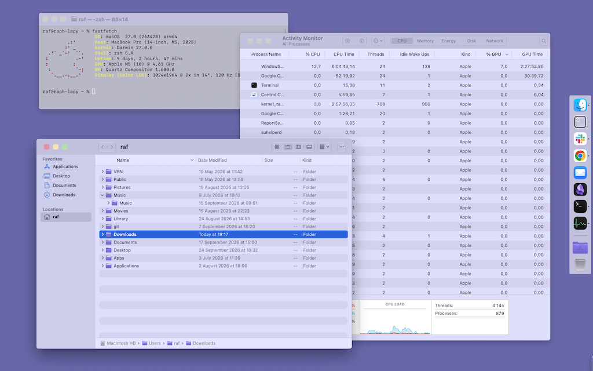

# Brutalium

A macOS tweak that lets you theme your macOS appearance.
It started as an extension of apple-sharpener (to square everything: corners, lights, menus, etc.) but has grown over time into a small theming system.
The name comes from a contraction of Solarium (Apple's name for the new UI system since Tahoe) and Brutalism/Neo-Brutalism style.



## Features:

- **Square window corners**: configurable radius.
- **Square everything corners**: buttons, fields, popovers, menus. Configurable radius.
- **Slim toolbar**: make the toolbar and its buttons smaller and less bulky.
- **Custom titlebar**: colour the titlebar or choose a background image.
- **Traffic-light buttons theming**: colour them, or choose images for them. Prebuilt themes included.
- **System tint**: recolour the whole UI — background glass, chrome, precise text, toolbar icons — to any colour. Prebuilt themes included.
- **Titlebar removal**: per-app opt-in.
- **Dock theming**: configurable background, border, and corner radius.
- **Window borders**: add borders, fully configurable.
- **Import/Export**: save and reapply your configuration, or build a shareable theme.

and more...

## Requirements

- MacOS Tahoe or better Golden Gate
- A working dylib injector: dynject (mine), or Ammonia / Plugin Playground (from CoreBedtime).
- Library validation disabled.

## Build & install

```sh
make
sudo make install
```

Relaunch apps to pick up the injection. Most settings changes apply live via `publish`;
changes to the per-app exclude/hide lists take effect on the target app's next launch. A
`com.tweak.brutalium.publish` LaunchAgent also republishes at login so sandboxed apps
get everything before launch.

Targeting note: most features apply everywhere and are scoped by per-app exclude/include
lists keyed by **bundle id**. Find one with `osascript -e 'id of app "Finder"'` or
`lsappinfo info -only bundleid $(pgrep -x Finder)`.

## Usage

```
Brutalium — window styling tweak for macOS Tahoe/Golden Gate

Usage: brutalium <group> <command> [args]

general:
  on | off | toggle
  status
  publish
  reset                         restore every setting to its default

window:
  window corners on | off
  window corners radius <value>
  window border on | off
  window border size <points>
  window border color <#RRGGBB>
  window border inactive <#RRGGBB|auto>
  window border shadow on | off
  window border edge <top|right|bottom|left> color <#RRGGBB|off>
  window border edge <top|right|bottom|left> image <path|off>
  window border corner <tl|tr|br|bl> color <#RRGGBB|off>
  window border corner <tl|tr|br|bl> image <path|off>

elements:
  elements on | off
  elements radius <value>

menus:
  menus on | off
  menus radius <value>
  menus shadow on | off
  menus selectcolor <#RRGGBB|off>

toolbar:
  toolbar on | off               force expanded toolbar
  toolbar slim on | off          reduce toolbar + button sizes
  toolbar slim height <value>    target toolbar strip height (default 36, was 52)
  toolbar slim radius <value>    glass capsule corner radius (default 5)
  toolbar exclude add | remove | list <bundleid>

titlebar:
  titlebar hide | show <bundleid>
  titlebar list
  titlebar color <#RRGGBB|off>   colour the titlebar strip
  titlebar image <path|off>

sidebar:
  sidebar tint on | off         override the sidebar's own colour (else follows tint chrome)
  sidebar tint color <#RRGGBB|auto>
  sidebar corners on | off      square the sidebar independently of corners elements
  sidebar corners radius <value>

lights:
  lights on | off
  lights radius <value>
  lights size <delta>
  lights color <close|min|zoom|inactive|glyph> <#RRGGBB>
  lights image <close|min|zoom> <path|off>
  lights theme <name> | list

tint:
  tint on | off
  tint color <#RRGGBB>
  tint chrome | text | accent <#RRGGBB|auto>
  tint mode auto | light | dark | none
  tint controls | icons | wallpaper on | off
  tint theme <name> | list
  tint exclude add | remove | list <bundleid>

glass:
  glass off | on
  glass color <#RRGGBB|auto>
  glass image <path|off>
  glass exclude add | remove | list <bundleid>

dock:
  dock on | off                 flat background behind Dock icons (only in com.apple.dock)
  dock color <#RRGGBB>          background colour (default #1C1C1E)
  dock radius <value>           corner radius, 0 = square (default 0)
  dock border on | off          border around the flat background
  dock border color <#RRGGBB>   border colour (default #FFFFFF)
  dock border size <value>      border width in points (default 1)

debug:
  debug tree on | off

config:
  config export [path]           export settings to plist
  config import <path>           import settings from plist
```

## Thanks

@CoreBedtime (Ammonia), @aspauldingcode (apple-sharpener), @MTACS (Zephyr)
